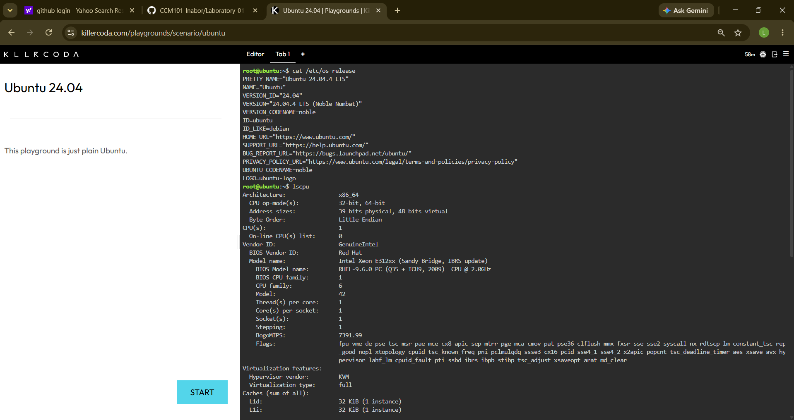

## Checkpoint 7 – Linux Cloud Migration

### Linux Server Information

- **Operating System:** Ubuntu 24.04.4 LTS
- **CPU:** Intel Xeon E312xx, 1 CPU
- **Memory:** 1.9 GiB RAM
- **Disk Space:** 19 GB total, 13 GB available

### Cloud Services That Could Host the Linux Server

| Cloud Platform | Service | Purpose |
|---|---|---|
| AWS | Amazon EC2 | Host the Ubuntu Linux virtual machine |
| Microsoft Azure | Azure Virtual Machines | Host the Ubuntu Linux virtual machine |
| Google Cloud | Compute Engine | Host the Ubuntu Linux virtual machine |

### Explanation

If this Linux server were migrated to the cloud, Amazon EC2, Azure Virtual Machines, or Google Compute Engine could be used to host it. These services provide virtual machines that can run Linux operating systems such as Ubuntu. The appropriate service would depend on the organization's preferred cloud provider, budget, performance requirements, and other business needs.

### Screenshot

*Figure 1. Linux server information collected using KillerCoda.*
