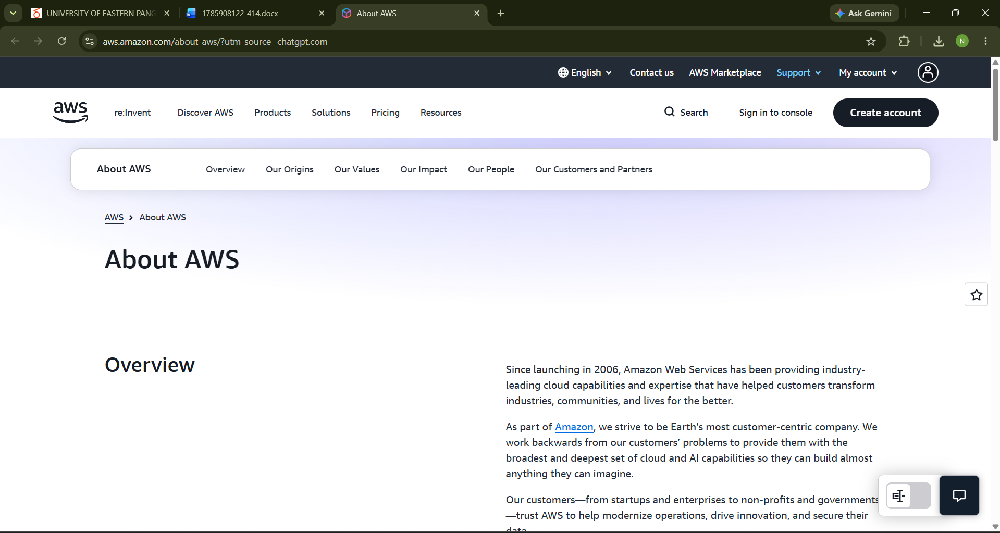

# AWS Research

## Brief Overview

Amazon Web Services (AWS) is a cloud computing platform operated by Amazon. AWS provides cloud and AI capabilities that organizations can use for different technology and business requirements.

## Global Infrastructure

AWS has a global infrastructure made up of Regions and Availability Zones. An AWS Region is a separate geographic area, while Availability Zones are isolated locations within a Region.

## Cloud Management Console

The AWS Management Console is a web-based interface used to access and manage AWS cloud resources.

## Four Core Services

1. **Amazon EC2** – provides virtual computing capacity.
2. **Amazon S3** – provides object storage.
3. **Amazon RDS** – provides managed relational databases.
4. **Amazon VPC** – provides a virtual networking environment.

## Three Advantages

1. **Global infrastructure** – AWS provides infrastructure across different geographic locations.
2. **Wide range of services** – AWS provides services for computing, storage, databases, networking, security, and other technologies.
3. **Scalability** – AWS resources can be adjusted according to workload requirements.

## Typical Enterprise Use Cases

AWS can be used by enterprises for web applications, data storage, databases, backup, analytics, and other business applications.

## Screenshot

## References

- Amazon Web Services. (n.d.). *About AWS*. https://aws.amazon.com/about-aws/
- Amazon Web Services. (n.d.). *AWS Regions and Availability Zones*. https://docs.aws.amazon.com/global-infrastructure/latest/regions/aws-regions-availability-zones.html
- Amazon Web Services. (n.d.). *AWS Management Console*. https://aws.amazon.com/console/
