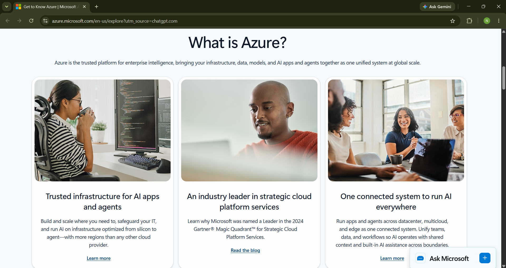

# Azure Research

## Brief Overview

Microsoft Azure is a cloud computing platform developed by Microsoft. It provides cloud and AI services that organizations can use to build, run, and manage applications across cloud, hybrid, and edge environments. Azure brings infrastructure, data, models, and AI applications together on a unified cloud platform (Microsoft, n.d.-a).

## Global Infrastructure

Azure has a global infrastructure consisting of regions and datacenters located in different geographic areas. Microsoft currently describes its global infrastructure as having more than 80 Azure regions and more than 500 datacenters. An Azure region consists of one or more datacenters connected through high-capacity, fault-tolerant, and low-latency networks (Microsoft, n.d.-b).

Azure regions can also provide different resiliency options, including Availability Zones in supported regions. Organizations can choose regions based on factors such as latency, data residency, regulatory requirements, and the resiliency needed by their applications (Microsoft, n.d.-b).

## Cloud Management Console

The Azure portal is a web-based, unified console used to create, manage, and monitor Azure resources. Users can manage their Azure subscription through a graphical interface and perform tasks such as creating databases, managing virtual machines, monitoring resources, and reviewing costs. The portal can also be customized with dashboards to organize frequently used resources (Microsoft, n.d.-c).

## Four Core Services

### 1. Azure Virtual Machines

Azure Virtual Machines provides scalable computing resources in the cloud. It allows organizations to run Windows or Linux virtual machines for different applications and workloads.

### 2. Azure Blob Storage

Azure Blob Storage is an object storage service used to store large amounts of unstructured data. It can be used for files, backups, archives, and data used by applications.

### 3. Azure SQL Database

Azure SQL Database is a managed relational database service. It helps organizations run SQL databases in the cloud while Microsoft manages many database administration tasks.

### 4. Microsoft Entra ID

Microsoft Entra ID is Microsoft's cloud-based identity and access management service. It helps organizations manage user identities and control access to applications and resources.

## Three Advantages

### 1. Global Enterprise Scale

Azure provides a large global infrastructure with regions and datacenters across different geographic areas. This allows organizations to choose locations that can help meet latency, data residency, and resiliency requirements (Microsoft, n.d.-b).

### 2. Security and Compliance

Azure provides security and compliance capabilities designed for enterprise environments. Microsoft states that Azure offers enhanced security, compliance, backup and recovery capabilities, and built-in resiliency features for high availability and disaster recovery (Microsoft, n.d.-a).

### 3. Flexibility and Scalability

Azure allows organizations to build, run, and scale applications using cloud, hybrid, and edge environments. Organizations can choose different technologies, tools, and services depending on their business and technical requirements (Microsoft, n.d.-a).

## Typical Enterprise Use Cases

Azure can be used by enterprises to host applications, run virtual machines, store organizational data, manage databases, and support artificial intelligence solutions. It can also be used to modernize existing IT infrastructure and support applications across cloud, hybrid, and edge environments (Microsoft, n.d.-a).

Azure can be especially useful for organizations that already use Microsoft technologies because it provides an integrated cloud platform for managing infrastructure, data, applications, and other enterprise workloads.

## Screenshot

*Figure 1. Official Microsoft Azure website screenshot.*

## References

- Microsoft. (n.d.-a). *Get to know Azure*. Microsoft Azure. https://azure.microsoft.com/en-us/explore/
- Microsoft. (n.d.-b). *Azure global infrastructure*. Microsoft Azure. https://azure.microsoft.com/en-us/explore/global-infrastructure/
- Microsoft. (n.d.-c). *What is the Azure portal?* Microsoft Learn. https://learn.microsoft.com/en-us/azure/azure-portal/azure-portal-overview
