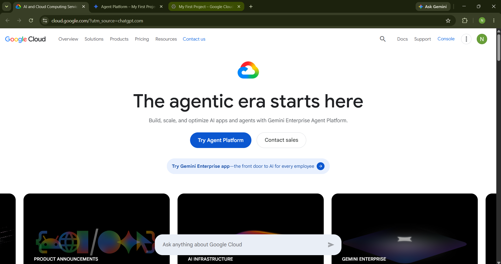

# GCP Research

## Brief Overview

Google Cloud is a cloud computing platform provided by Google. It offers a wide range of services that organizations can use to build, deploy, and manage applications and workloads. Google Cloud provides services for computing, storage, databases, networking, data analytics, artificial intelligence, and machine learning (Google Cloud, n.d.-a).

## Global Infrastructure

Google Cloud has a global infrastructure organized into regions and zones. A region is an independent geographic area that contains multiple zones, while a zone is a deployment area for Google Cloud resources within a region. Google Cloud uses regions and zones to help organizations improve application availability, reliability, and performance (Google Cloud, n.d.-b).

Google Cloud provides infrastructure across multiple regions and zones around the world. This allows organizations to deploy workloads closer to their users and meet requirements related to latency, availability, and data residency (Google Cloud, n.d.-c).

## Cloud Management Console

The Google Cloud console is a web-based interface used to create, manage, and monitor Google Cloud resources. Users can use the console to work with different cloud services, organize resources into projects, and manage applications and infrastructure through a graphical interface (Google Cloud, n.d.-a).

## Four Core Services

### 1. Compute Engine

Compute Engine is an Infrastructure as a Service (IaaS) product that provides virtual machine instances and computing resources. Organizations can use Compute Engine to run applications and workloads using Linux or Windows virtual machines (Google Cloud, n.d.-d).

### 2. Cloud Storage

Cloud Storage is an object storage service that allows organizations to store and access data in Google Cloud. It can be used for applications, backups, archives, and other types of data storage (Google Cloud, n.d.-a).

### 3. Cloud SQL

Cloud SQL is a managed relational database service for MySQL, PostgreSQL, and SQL Server. It helps organizations run relational databases in Google Cloud without having to manage the underlying database infrastructure themselves (Google Cloud, n.d.-a).

### 4. Google Kubernetes Engine

Google Kubernetes Engine (GKE) is a managed Kubernetes service used to deploy, manage, and scale containerized applications. It provides organizations with a managed environment for running Kubernetes workloads (Google Cloud, n.d.-a).

## Three Advantages

### 1. Global Infrastructure

Google Cloud provides infrastructure across multiple regions and zones around the world. Organizations can select locations based on requirements such as latency, availability, and data residency (Google Cloud, n.d.-b).

### 2. Strong Data and AI Capabilities

Google Cloud provides services for data analytics, artificial intelligence, and machine learning in addition to its core infrastructure services. This allows organizations to combine computing, storage, data, and AI technologies when developing applications and solutions (Google Cloud, n.d.-a).

### 3. Scalability and Reliability

Google Cloud allows organizations to distribute resources across regions and zones. Deploying resources across multiple zones can help reduce the impact of infrastructure failures and improve the availability of applications (Google Cloud, n.d.-b).

## Typical Enterprise Use Cases

Google Cloud can be used by enterprises for hosting applications, running virtual machines, storing data, managing relational databases, deploying containerized applications, and developing artificial intelligence and machine learning solutions. Its services can also support data analytics and global applications that require scalable and highly available infrastructure (Google Cloud, n.d.-a).

For example, enterprises can use Compute Engine for virtual machines, Cloud Storage for data storage, Cloud SQL for relational databases, and Google Kubernetes Engine for containerized applications (Google Cloud, n.d.-a).

## Screenshot

*Figure 1. Official Google Cloud website screenshot.*

## References

- Google Cloud. (n.d.-a). *Google Cloud overview*. Google Cloud Documentation. https://docs.cloud.google.com/docs/overview
- Google Cloud. (n.d.-b). *Geography and regions*. Google Cloud Documentation. https://docs.cloud.google.com/docs/geography-and-regions
- Google Cloud. (n.d.-c). *Cloud locations*. Google Cloud. https://cloud.google.com/about/locations
- Google Cloud. (n.d.-d). *Compute Engine overview*. Google Cloud Documentation. https://docs.cloud.google.com/compute/docs/overview
